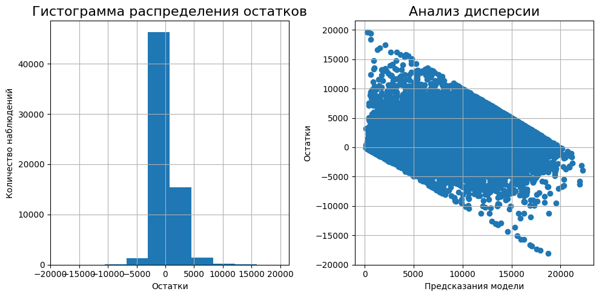
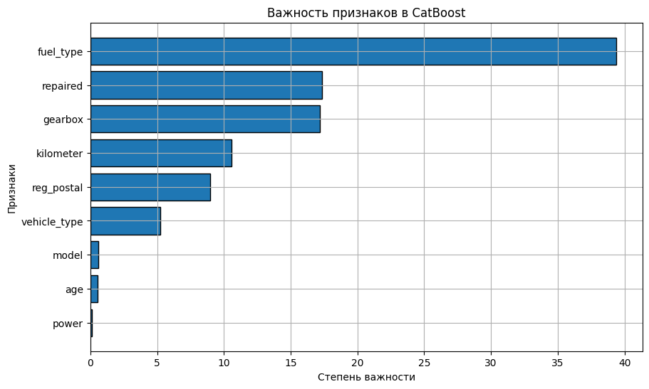

# Проект: Предсказание цены автомобилей
## :dart:** Цель проекта:**
Разработка прогнозной модели цены автомобиля в зависимости от технических характеристик, комплектации. Модель будет встроена в приложение, которое должно быстро и качественно оценивать автомобили пользователей. Поэтому для заказчика важны следующие критерии работы модели:
+ качество предсказания;
+ время обучения модели;
+ время предсказания модели

## :file_folder:**Файлы:**

Данные представлены файлом *autos.csv*

## :clipboard:**Описание данных:**

| Признак             | Описание                                            |
|---------------------|-----------------------------------------------------|
| `DateCrawled`       | Дата скачивания анкеты из базы                      |
| `VehicleType`       | Тип автомобильного кузова                           |
| `RegistrationYear`  | Год регистрации автомобиля                          |
| `Gearbox`           | Тип коробки передач                                 |
| `Power`             | Мощность (л.с.)                                     |
| `Model`             | Модель автомобиля                                   |
| `Kilometer`         | Пробег (в километрах)                               |
| `RegistrationMonth` | Месяц регистрации автомобиля                        |
| `FuelType`          | Тип топлива                                         |
| `Brand`             | Марка автомобиля                                    |
| `Repaired`          | Была ли машина в ремонте                            |
| `DateCreated`       | Дата создания анкеты                                |
| `NumberOfPictures`  | Количество фотографий автомобиля                    |
| `PostalCode`        | Почтовый индекс владельца анкеты                    |
| `LastSeen`          | Дата последней активности пользователя             |

*Целевой признак:*

*Price* — цена (евро)

## :scroll:**План исследования:**

1. Подготовка данных
    1. Предобработка
    2. Исследовательский анализ
2. Обучение моделей
    1. Подготовка выборки
    2. Подбор моделей
3. Анализ выбранных моделей

## :white_check_mark:**Результаты:**

+ Проведён EDA, обнаружены выбросы и сильные корреляции между категориальными признаками
+ Выбраны модели, устойчивые к выбросам и способные захватывать нелинейные зависимости:
   + Decision Tree Regressor,
   + LGBMRegressor,
   + CatBoostRegressor.

+ Выполнен подбор гиперпараметров и сравнение по метрике RMSE и времени работы

Лучшей моделью по соотношению скорость / точность стал CatBoostRegressor, показавший:

+ RMSE = 1711
+ Высокую стабильность и точность предсказаний
+ Умеренное время обучения и предсказания

## :bar_chart:**Примеры визуализаций**

