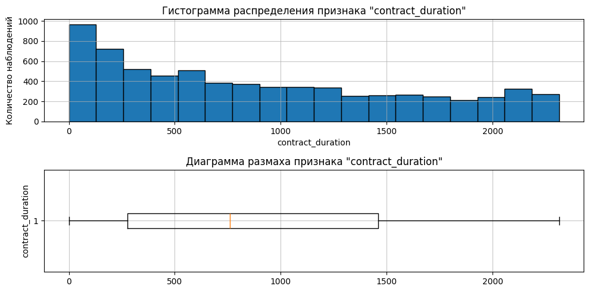
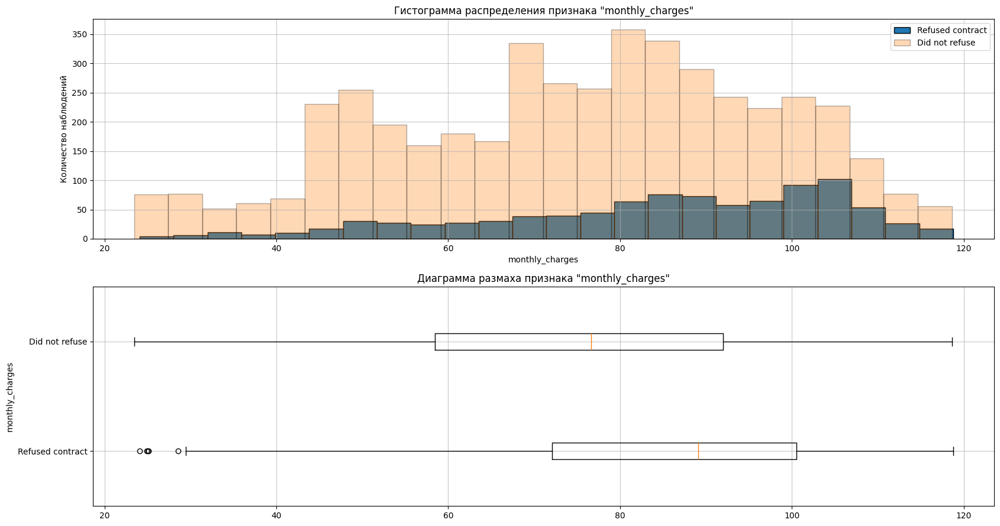
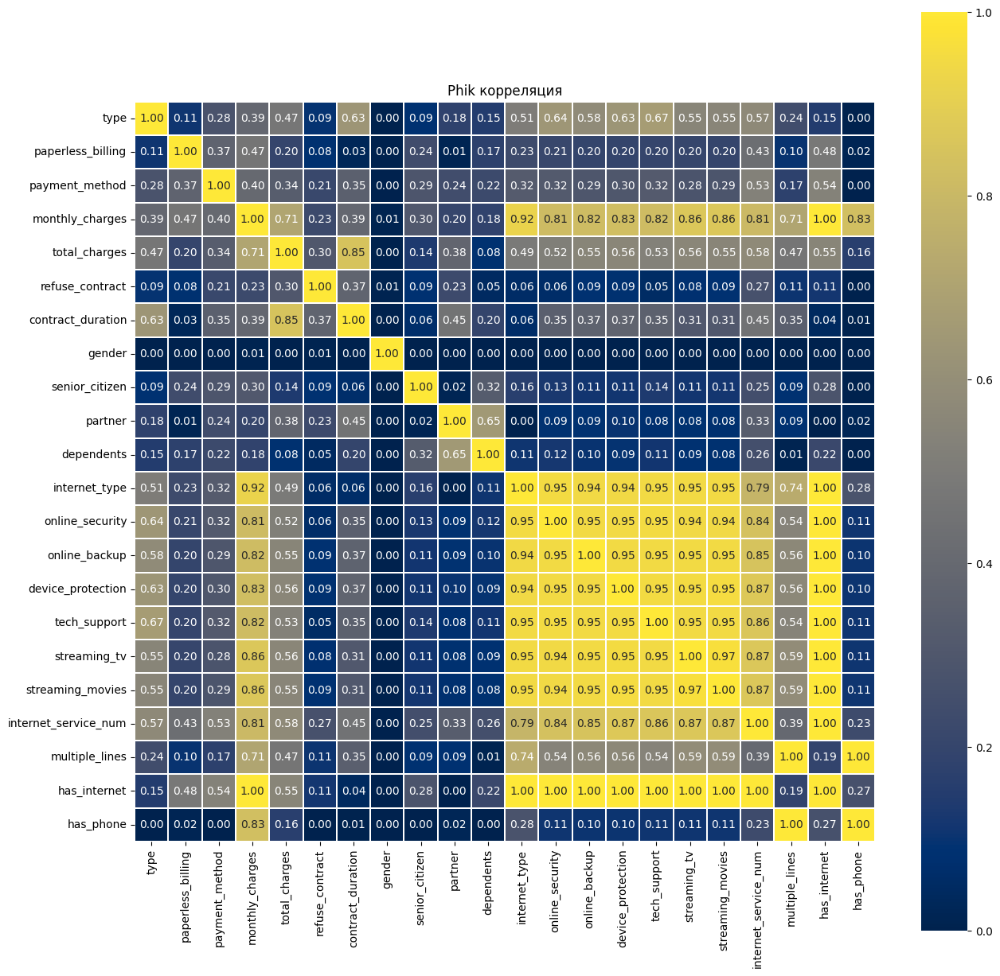
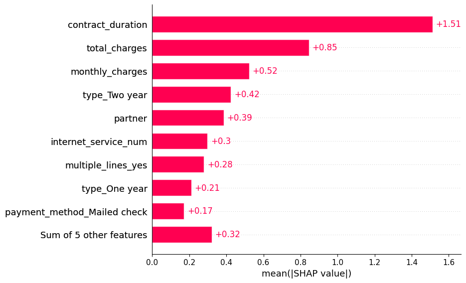

# Предсказание клиентов, покидающих компанию

*Заказчик*: оператор связи, предоставляющий клиентам услуги:
+ стационарной телефонной связи;
+ интернета:
    + DSL - подкдючение;
    + оптоволоконное подключение.

Также выделяют дополнительные услуги компании:
+ Интернет безопасность: предоставление антивируса; блокировка небезопасных интернет ресурсов.
+ Выделенная линия технической поддержки.
+ Облачное хранилище.
+ Стриминговое телевидение и каталог фильмов.

*Проблема*: заказчик наблюдает повышенный отток клиентов. Для решения проблемы компания хочет предлагать скидки и особые условия клиентам, собирающимся разорвать договор.

## :dart:** Цель проекта:**
Прогнозирование оттока клиентов. Главная задача - выявить клиентов, способных разорвать договор с оператором связи. Данную задачу возможно осуществить, построив прогнозную модель бинарной классификации клиентов: клиент расторгнет договор/ клиент не расторгнет договор.

## :clipboard:**Описание данных:**

Компания-заказчик для решения задачи предоставляет информацию клиентской базы, которая включает следующие файлы:

| Признак              | Описание                          |
|-------------------|-----------------------------------|
| `contract_new.csv` | Информация о договоре             |
| `personal_new.csv` | Персональные данные клиента       |
| `internet_new.csv` | Информация об интернет-услугах    |
| `phone_new.csv`    | Информация об услугах телефонии   |

*Данные файла contract_new.csv*:
| Признак            | Описание                                      |
|--------------------|-----------------------------------------------|
| `customerID`        | Идентификатор абонента                        |
| `BeginDate`         | Дата начала действия договора                 |
| `EndDate`           | Дата окончания действия договора              |
| `Type`              | Тип оплаты: раз в год-два или ежемесячно     |
| `PaperlessBilling`  | Электронный расчётный лист                   |
| `PaymentMethod`     | Тип платежа                                   |
| `MonthlyCharges`    | Расходы за месяц                              |
| `TotalCharges`      | Общие расходы абонента                        |

*Данные файла personal_new.csv*:
| Признак          | Описание                              |
|------------------|----------------------------------------|
| `customerID`     | Идентификатор пользователя             |
| `gender`         | Пол                                   |
| `SeniorCitizen`  | Является ли абонент пенсионером       |
| `Partner`        | Есть ли у абонента супруг/супруга     |
| `Dependents`     | Есть ли у абонента дети               |

*Данные файла internet_new.csv*:
| Признак             | Описание                                                             |
|---------------------|----------------------------------------------------------------------|
| `customerID`        | Идентификатор пользователя                                           |
| `InternetService`   | Тип подключения                                                      |
| `OnlineSecurity`    | Блокировка опасных сайтов                                            |
| `OnlineBackup`      | Облачное хранилище файлов для резервного копирования данных         |
| `DeviceProtection`  | Антивирус                                                            |
| `TechSupport`       | Выделенная линия технической поддержки                              |
| `StreamingTV`       | Стриминговое телевидение                                             |
| `StreamingMovies`   | Каталог фильмов                                                      |

*Данные файла phone_new.csv*:
| Признак           | Описание                                                     |
|-------------------|--------------------------------------------------------------|
| `customerID`      | Идентификатор пользователя                                   |
| `MultipleLines`   | Подключение телефона к нескольким линиям одновременно        |

## :scroll:**План проекта:**
1. Знакомство с данными. 
2. Предобработка. Подготовка к первичному анализу.
2. Исcледовательский анализ данных. Отбор признаков для модели.
4. Подготовка данных для моделирования.
5. Построение моделей. Выбор лучшей модели.
6. Анализ модели. 
7. Выводы и рекомендации.

## :white_check_mark:**Результаты:**

Ключевые шаги и результаты:

+ Проведена очистка и объединение данных из 4 таблиц (контракт, интернет, телефония, персональные данные) по 7043 клиентам.
+ Проведён EDA: выявлены важные зависимости между признаками и целевой переменной refuse_contract.
+ Построены новые признаки: длительность контракта, наличие интернета и телефона, количество интернет-услуг и др.
+ Обучены модели: Logistic Regression, Decision Tree, CatBoost, LGBM.

Итоговая модель:
+ LGBMClassifier
+ ROC AUC на тесте: 0.92 (при целевом уровне 0.85)
+ Хорошо предсказывает класс «остаются» (точность 95%), хуже — «уходят» (точность ~68%).

Ключевые факторы оттока:
+ Небольшой срок контракта (менее 2 лет).
+ Высокие ежемесячные платежи.
+ Оплата автоматическими способами.
+ Активное использование множества интернет-услуг.
+ Наличие нескольких телефонных линий.
+ Наличие партнёра (семейное потребление).

Рекомендации бизнесу:
+ Разработать удерживающие программы для новых клиентов (до 6 месяцев) с активным потреблением услуг.
+ Предложить персонализированные семейные или долгосрочные тарифы для клиентов с партнёром.
+ Мониторить клиентов с высоким MonthlyCharges и короткой историей — они наиболее подвержены оттоку.

## :bar_chart:**Примеры визуализаций**

