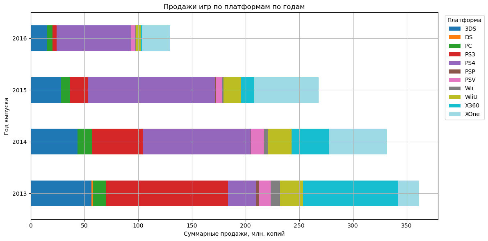
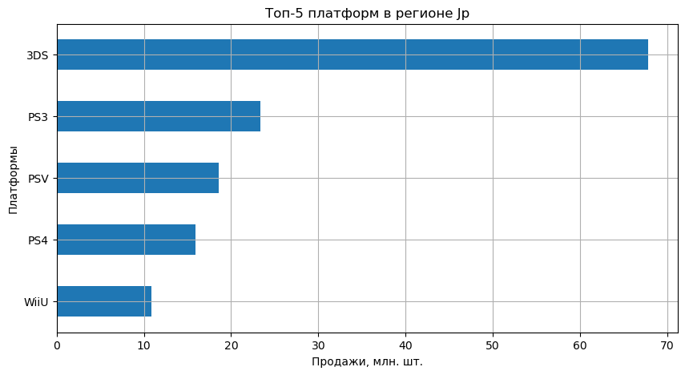
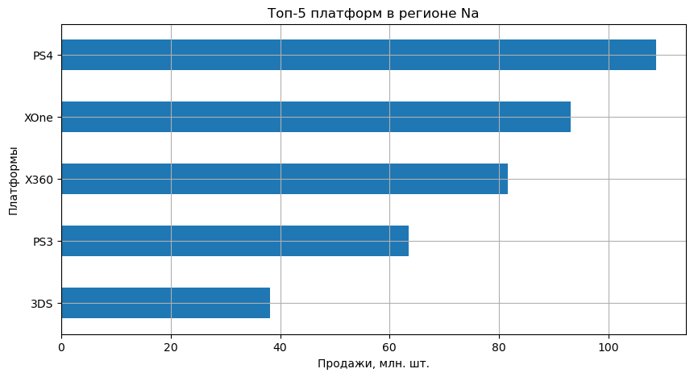

# :video_game:Статистическое исследование данных компьютерных и видеоигр

## ** :dart:Цель исследования:**

Выявление закономерностей, определяющих успешность игры. 
Прогнозирование популярных проектов для планирования рекламных кампаний интернет-магазина.

## :file_folder:**Файлы:**
games.csv

## :clipboard:**Описание данных:**
Исторические данные (до 2016 г.) о продажах игр, оценки пользователей и экспертов, жанры и платформы из открытых источников. Таблица содержит следующие столбцы:
| Колонка          | Описание |
|------------------|----------|
| `Name`           | Название игры |
| `Platform`       | Игровая платформа |
| `Year_of_Release`| Год выпуска |
| `Genre`          | Жанр игры |
| `NA_sales`       | Продажи в Северной Америке (млн копий) |
| `EU_sales`       | Продажи в Европе (млн копий) |
| `JP_sales`       | Продажи в Японии (млн копий) |
| `Other_sales`    | Продажи в других странах (млн копий) |
| `Critic_Score`   | Оценка критиков (0–100) |
| `User_Score`     | Оценка пользователей (0–10) |
| `Rating`         | Возрастной рейтинг ESRB |

## :scroll:**План исследования:**

1. Загрузка и знакомство с данными. Оценка качества данных.
2. Работа по устранению проблем в данных.
3. Исследовательский анализ данных.
4. Работа с гипотезами.
5. Общий вывод.

## :white_check_mark:**Результаты:**

Анализ данных за период 2013–2016 годов выявил, что платформы PS4
и XOne демонстрируют рост продаж, тогда как 3DS теряет 
популярность, а PC и WiiU сохраняют стабильность. 
Продажи игр положительно коррелируют с оценками критиков, 
однако пользовательские оценки практически не влияют на 
коммерческий успех. Региональные особенности важны: 
европейские и североамериканские рынки предпочитают экшн- и 
спортивные игры, а японский рынок ориентирован на ролевые игры и 
портативные консоли.

Рейтинг ESRB не влияет на продажи и не подходит для их 
прогнозирования, однако в Европе и Северной Америке хиты 
чаще имеют рейтинг M, а в Японии — рейтинг E. Пользовательские 
оценки игр на платформах Xbox One и PC схожи, поэтому аудитории 
этих платформ можно рассматривать как единую для маркетинга. 
При этом оценки жанров Action и Sports различаются, что 
указывает на необходимость отдельного рекламного подхода для 
каждой аудитории.

## :bar_chart:**Примеры визуализаций**

