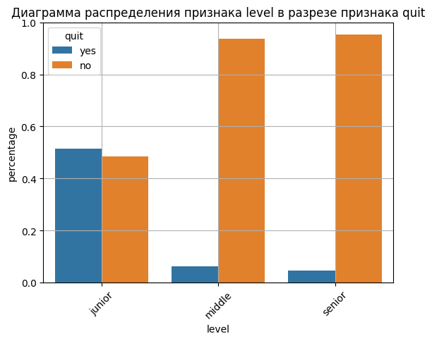
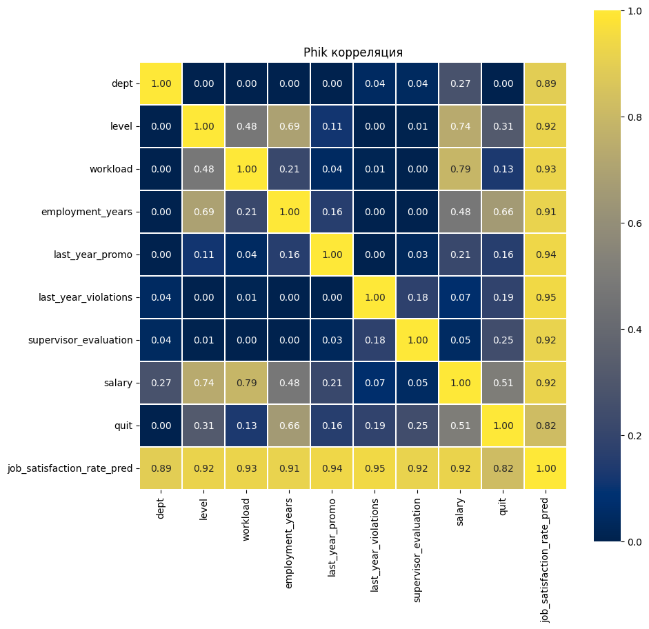

# Моделирование в HR-аналитике. Оптимизация управления персоналом.

## :dart:** Цель исследования:**

В HR-аналитическую компанию поступил запрос от бизнеса по оптимизации управления персоналом. На основе предоставленных данных необходимо предложить, как избежать финансовых потерь и оттока сотрудников. Для увеличения скорости и точности решений, было решено использовать машинное обучение. Для этого надо построить две модели:
+ первая модель должна предсказать уровень удовлетворённости сотрудника на основе данных заказчика.
+ вторая модель должна  на основе данных заказчика предсказать то, что сотрудник уволится из компании.

## :file_folder:**Файлы:**

Данные для решения задачи предсказания уровня удовлетворенности сотрудника:  
**train_job_satisfaction_rate.csv** - тренировочная выборка;  
**test_features.csv** - входные признаки тестовой выборки;  
**test_target_job_satisfaction_rate.csv** - целевой признак тестовой выборки.  

Данные для решения задачи предсказания возможности увольнения сотрудника:  
**train_quit.csv** - тренировочная выборка;     
**test_features.csv** - входные признаки тестовой выборки;  
**test_target_quit.csv** - целевой признак тестовой выборки.

## :clipboard:**Описание данных:**

*Данные о сотрудниках компании:*
| Признак                  | Описание                                                                 |
|--------------------------|--------------------------------------------------------------------------|
| `id`                     | Уникальный идентификатор сотрудника                                      |
| `dept`                   | Отдел, в котором работает сотрудник                                      |
| `level`                  | Уровень занимаемой должности                                             |
| `workload`               | Уровень загруженности сотрудника                                         |
| `employment_years`       | Длительность работы в компании (в годах)                                 |
| `last_year_promo`        | Было ли повышение за последний год                                       |
| `last_year_violations`   | Нарушал ли сотрудник трудовой договор за последний год                   |
| `supervisor_evaluation`  | Оценка качества работы сотрудника от руководителя                        |
| `salary`                 | Ежемесячная зарплата сотрудника                                          |
| `job_satisfaction_rate`  | Уровень удовлетворённости работой в компании (целевой признак)           |

## :scroll:**План исследования:**

1. Загрузка и предпросмотр данных.
2. Предобработка данных.
3. Исследовательский анализ.
4. Выбор и построение модели.

## :white_check_mark:**Результаты:**

Задача 1: Прогноз удовлетворённости 
+ Тип задачи: регрессия
+ Целевой признак: job_satisfaction_rate (от 0 до 100%)
+ Модель-лидер: DecisionTreeRegressor
+ SMAPE: 13.90% на тестовой выборке
+ Особенности обработки:
  + Автоматическая подготовка данных с помощью Pipeline
  + Работа с категориальными и числовыми признаками
  + Учет выбросов и нелинейных связей

Задача 2: Прогноз увольнения сотрудника
+ Тип задачи: бинарная классификация
+ Целевая переменная: will_leave (да/нет)
+ Модель-лидер: KNeighborsClassifier
+ ROC-AUC: 0.92
+ Ключевые предикторы оттока:
  + Junior-уровень, стаж < 4 лет
  + Отсутствие повышения и низкая оценка руководства
  + ЗП < 35 тыс., неудовлетворённость работой

Модель дополнительно использует предсказанный уровень удовлетворённости как признак, усиливая точность прогноза.

Выводы и рекомендации:
+ Модели помогают HR-службе своевременно выявлять сотрудников с риском увольнения и сниженной мотивацией.
+ Позволяют формировать персональные планы удержания: повышение, пересмотр условий труда, корректировка нагрузки и заработной платы.
+ В фокусе риска — junior-сотрудники, не видящие перспектив и чувствующие перегрузку.

## :bar_chart:**Примеры визуализаций**

