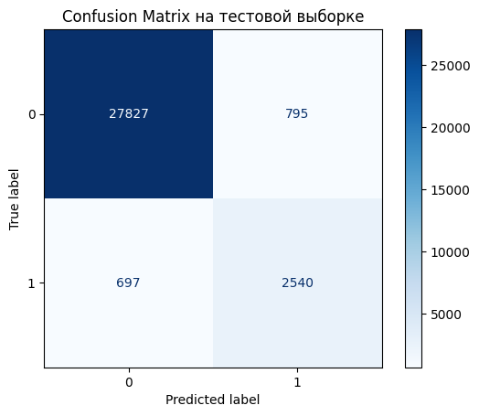

# Классификация комментариев

Интернет-магазин внедряет новый сервис, с помощью которого пользователи будут иметь возможность редактировать и дополнять описания товаров магазина. Кроме очевидной пользы: выстраивания и развития сообщества клиентов, актуализации описаний товаров, новый сервис может дает возможность недобросовестным пользователям оставлять токсичные комментарии, которые могут стать причиной конфликтов, а также источником необъективной информации. Поэтому в таком сервисе необходимо иметь инструмент автоматического поиска подобных токсичных комментариев и отправки на модерацию.

## :dart:** Цель проекта:**

Данный проект посвящен разработке этого инструмента, а именно модели, классифицирующей комментарии как позитивные или негативные. Пороговой метрикой является f-score, превышающий значение 0.75.

## :file_folder:**Файлы:**

В нашем распоряжении файл toxic_comments.csv, содержащий набор данных с разметкой о токсичности правок.

## :clipboard:**Описание данных:**

| Название признака | Описание                                                  |
|-------------------|-----------------------------------------------------------|
| `text`            | Текст комментария                                         |
| `toxic`           | Целевой признак: токсичность комментария (0 — нет, 1 — да) |

## :scroll:**План исследования:**

Проект будет проведен в несколько этапов:

1. Подготовка данных к обучению
    1. Загрузка и предпросмотр
    2. Подготовка текста для обучения модели
2. Обучение
    1. Подбор модели
    2. Тестирование

## :white_check_mark:**Результаты:**

В рамках проекта была разработана модель классификации тональности комментариев для интернет-магазина Викишоп. Ключевые этапы работы:
+ Очистка и лемматизация текста.
+ Токенизация (униграммы и биграммы).
+ Векторизация с использованием частоты токенов.
+ Подбор и оценка моделей: LogisticRegression, LinearSVC, LGBMClassifier.

Лучшая модель — LinearSVC, благодаря высокой скорости и точности.

Качество на тесте:
+ F1-score: 0.773
+ Recall: 0.785
+ Precision: 0.761

## :bar_chart:**Примеры визуализаций**

