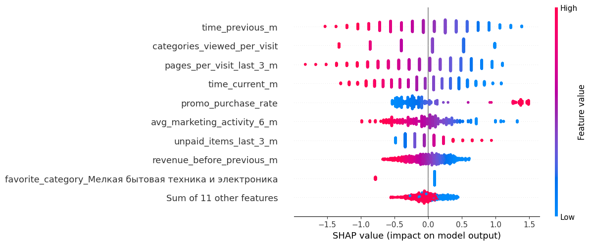
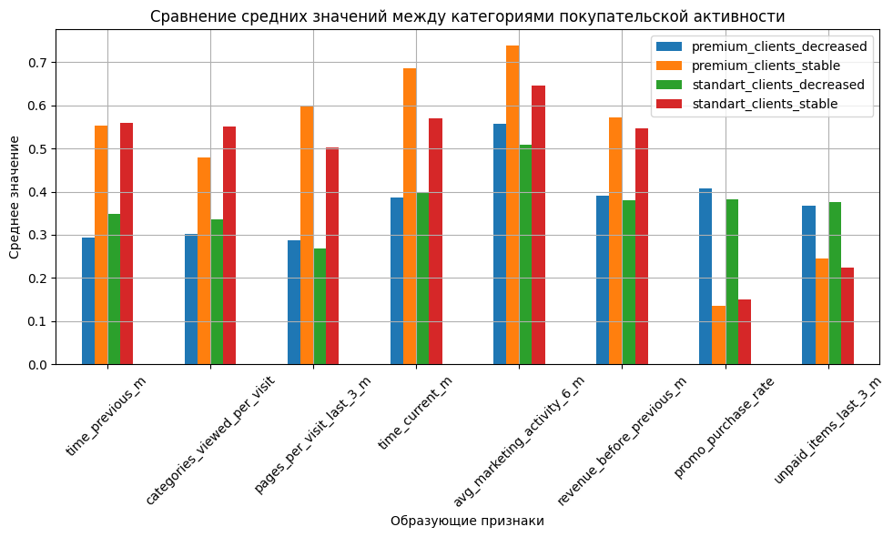

# Система прогнозирования покупательской активности и персонализации предложений интернет-магазина

## :dart:** Цель исследования:**

Интернет-магазин обнаружил снижение покупательной активности постоянных клиентов. Для ее удержания решили построить систему персональных предложений для сегмента постоянных покупателей. Для реализации этой задачи необходимо:
+ построить модель, прогнозирующую вероятность снижения покупательской активности клиента в следующие три месяца;
+ разработать персонализированные предложения для клиентов разных сегментов прибыльности.

## :file_folder:**Файлы:**

**market_file.csv** - данные о поведении покупателя на сайте;  
**market_money.csv** - таблица с данными о выручке, которую получает магазин с покупателя, то есть сколько покупатель всего потратил за период взаимодействия с сайтом.  
**market_time.csv** - таблица с данными о времени (в минутах), которое покупатель провёл на сайте в течение периода.  
**money.csv** - таблица с данными о среднемесячной прибыли покупателя за последние 3 месяца: какую прибыль получает магазин от продаж каждому покупателю.

## :clipboard:**Описание данных:**

*Данные о поведении покупателя на сайте:*
| Признак                             | Описание                                                                                 |
|-------------------------------------|------------------------------------------------------------------------------------------|
| `id`                                | Номер покупателя в корпоративной базе данных                                            |
| `Покупательская активность`         | Целевой признак — класс покупательской активности: «снизилась» или «прежний уровень»    |
| `Тип сервиса`                       | Уровень сервиса, например «премиум» и «стандарт»                                        |
| `Разрешить сообщать`               | Согласие покупателя на получение дополнительных товарных предложений                    |
| `Маркет_актив_6_мес`               | Среднемесячное число маркетинговых коммуникаций за последние 6 месяцев                  |
| `Маркет_актив_тек_мес`             | Число маркетинговых коммуникаций в текущем месяце                                       |
| `Длительность`                      | Количество дней с момента регистрации покупателя на сайте                              |
| `Акционные_покупки`                | Среднемесячная доля покупок по акции за последние 6 месяцев                             |
| `Популярная_категория`             | Самая популярная категория товаров у покупателя за последние 6 месяцев                  |
| `Средний_просмотр_категорий_за_визит` | Среднее число категорий, просмотренных за визит в последний месяц                      |
| `Неоплаченные_продукты_штук_квартал` | Общее количество неоплаченных товаров в корзине за последние 3 месяца                  |
| `Ошибка_сервиса`                   | Количество сбоев, с которыми столкнулся покупатель при использовании сайта              |
| `Страниц_за_визит`                 | Среднее число страниц, просмотренных за визит за последние 3 месяца                     |

*Данные о выручке:*
| Признак     | Описание                                                                 |
|-------------|--------------------------------------------------------------------------|
| `id`        | Номер покупателя в корпоративной базе данных                             |
| `Период`    | Название периода, во время которого зафиксирована выручка (например, 'текущий_месяц' или 'предыдущий_месяц') |
| `Выручка`   | Сумма выручки за указанный период                                         |

*Данные о времени (в минутах), которое покупатель провёл на сайте в течение периода:*
| Признак     | Описание                                                                 |
|-------------|--------------------------------------------------------------------------|
| `id`        | Номер покупателя в корпоративной базе данных                             |
| `Период`    | Название периода, во время которого зафиксировано общее время            |
| `минут`     | Время, проведённое покупателем на сайте за указанный период (в минутах)  |

*Данные о среднемесячной прибыли покупателя за последние 3 месяца:*
| Признак     | Описание                                          |
|-------------|---------------------------------------------------|
| `id`        | Номер покупателя в корпоративной базе данных      |
| `Прибыль`   | Значение прибыли, полученной от покупателя        |

## :scroll:**План исследования:**

1. Загрузка и предпросмотр данных
2. Предобработка данных
3. Исследователский анализ
4. Выбор и построение модели
5. Интерпретация
6. Сегментация покупателей и рекомендации сегментам

## :white_check_mark:**Результаты:**

+ Построена прогнозная модель на основе данных о поведении 1300 клиентов: активность на сайте, выручка, время, проведённое на платформе, и среднемесячная прибыль.
+ Выполнен EDA: выявлены выбросы, дисбаланс классов и ключевые поведенческие паттерны.
+ Построена ML-модель с использованием пайплайна и подбора гиперпараметров. Лучшая модель — логистическая регрессия с ROC-AUC = 0.90.
+ Проведена интерпретация модели с помощью SHAP для выделения ключевых факторов и сегментов риска.

Снижение активности связано с:
+ сниженным интересом к платформе и маркетинговым коммуникациям;
+ высоким уровнем промо-покупок;
+ частыми неоплаченными товарами;
+ узким кругом интересов (мало категорий, низкая вовлечённость).

Высокое маркетинговое взаимодействие помогает удерживать клиентов.

Выявлены две ключевые группы клиентов:
+ Лояльные, постоянные покупатели.
+ Зависимые от промо-акций, склонные к снижению активности.

Рекомендации:
+ Повышать вовлечённость через персонализированные рассылки и разнообразие категорий.
+ Оптимизировать политику акций — не поощрять чрезмерную зависимость от скидок.
+ Контролировать неоплаченные товары — стимулировать завершение покупок.
+ Разрабатывать персональные стратегии удержания для сегментов с высоким риском снижения активности.

## :bar_chart:**Примеры визуализаций**

