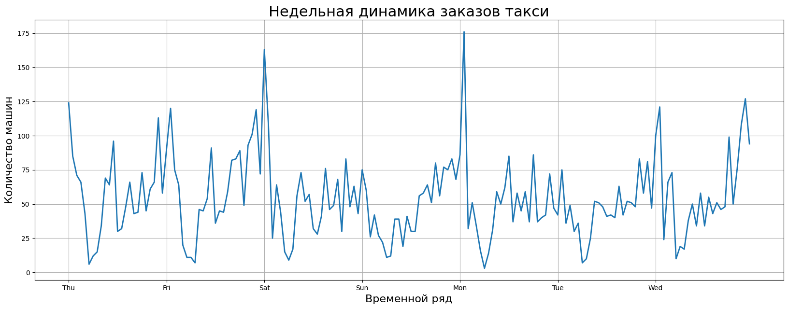
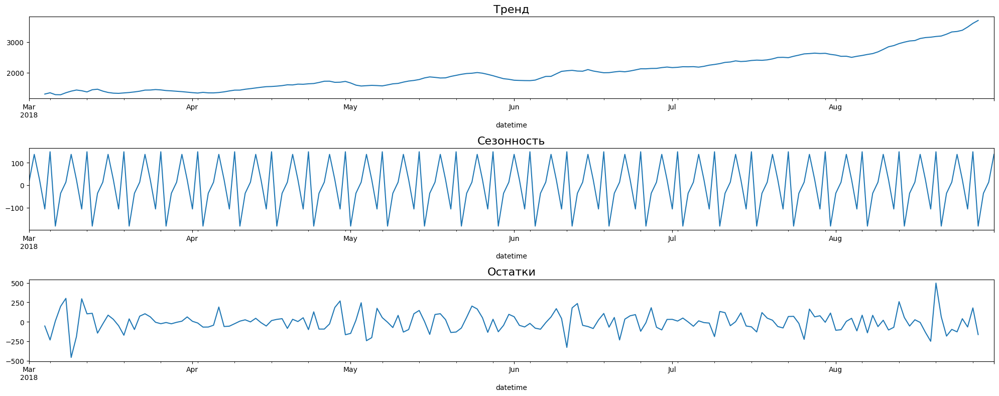

# Прогнозирование вызовов такси
## :dart:** Цель проекта:**

Данный проект был проведен по заказу одного таксопарка. Запросом данной компании является создание модели, позволяющей прогнозировать количество такси, требуемых на час вперед.   

## :file_folder:**Файлы:**

Для обучения модели был предоставлен датасет из файла `taxi.csv`.

## :clipboard:**Описание данных:**

| Признак      | Описание                                               |
|--------------|--------------------------------------------------------|
| `num_orders` | Количество заказов (целевой признак)                  |
| `datetime`   | Временная метка с шагом 10 минут                      |

## :scroll:**План исследования:**

1. Загрузка данных и предпросмотр
2. Анализ
3. Подбор и обучение модели
4. Тестирование и анализ прогноза.

## :white_check_mark:**Результаты:**

В результате EDA были выявлены ключевые особенности временного ряда:

+ Суточная и недельная сезонность: минимальные значения ночью, пики в вечерние часы, а также увеличенный спрос в пятницу и воскресенье.
+ Восходящий тренд на протяжении всего периода.

Для повышения качества модели выполнена трансформация данных:
+ Логарифмирование целевого признака для уменьшения разброса значений;
+ Лагирование — добавление признаков со сдвигом значений по времени.

Были протестированы линейные модели: LinearRegression, Ridge, Lasso, ElasticNet.
Наилучший результат показала модель ElasticNet, достигнув значения RMSE = 46, что удовлетворяет требованиям заказчика.

## :bar_chart:**Примеры визуализаций**

